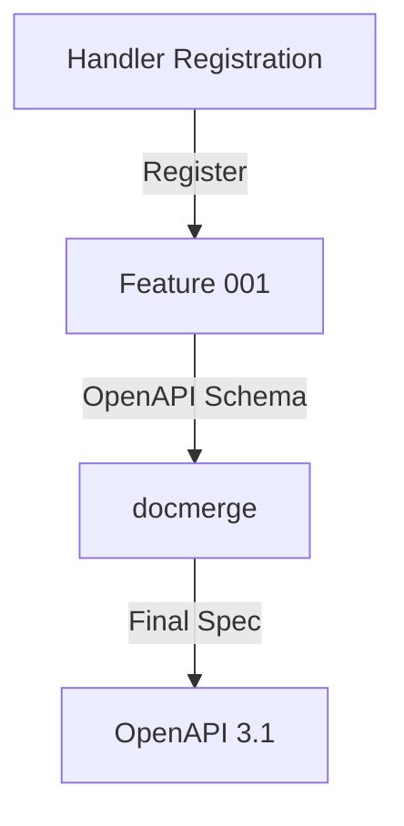

# RFC: Handler Description

## Overview

This RFC describes the technical implementation of the Handler Description feature ([Feature 003](/doc/features/003-handler-description.md)), which provides a runtime interface for OpenAPI 3.1 handler description generation.

## Technical Analysis

### Current Architecture

The system currently has two key components:

1. Feature 001 (Runtime Inspection) - Provides runtime type information and OpenAPI generation via `openapi/httpinmeditate`
2. `openapi/docmerge` - Handles documentation preservation and merging

### Integration Points



## Implementation Details

### Package Structure

```
pontoon/
└── httpinoapi/
    ├── register.go    # Handler registration interface
    ├── options.go     # Registration options
    └── merge.go   # Integration with Feature 001 and docmerge
```

### Core Interface

```go

type Generator struct {
// ...
}

// Operation registers an HTTP handler in the group
func (h *Generator) Operation(verb string, path string, handler interface{}, opts ...Option) error

// Build returns a complete OpenAPI 3.1 document with all registered handlers.
func (h *Generator) Build() (*v3.Document, error)

// Option configures handler registration
type Option func(*options)

// WithTags adds OpenAPI tags to the handler
func WithTags(tags ...string) Option

// WithInputStruct specifies the input struct
func WithInputStruct(inputStruct any) Option

// WithOutputStruct specifies the output struct
func WithOutputStruct(outputStruct any) Option

```

### Integration Flow

1. **Handler Registration**

   ```go
   // User code
   gen := NewGenerator()

   // add one handler
   err := gen.Operation(http.MethodGet, "/users/:id", GetUserHandler,
       WithTags("users"),
       WithInputStruct(GetUserRequest{}),
       WithOutputStruct(GetUserResponse{}),)
   if err != nil {
       // Handle error
   }

   // add another handler
   err := gen.Operation(http.MethodPost, "/users", CreateUserHandler,
       WithTags("users"),
       WithInputStruct(CreateUserRequest{}),
       WithOutputStruct(CreateUserResponse{}),)
   if err != nil {
       // Handle error
   }
   
   // ...
   ```

2. **OpenAPI Generation**

   ```go

  // internal flow
   oapigen := httpinmeditate.NewGenerator()

   ops := []*v3.Operation{}

  for _,handler := g.handlers {
      op := v3.NewOperation(&v3.Operation{
      // fill in basic info, Go type extensions, verbs,paths etc
      })
     // ...
     if handler.inputStruct != nil {
      handlerBody,handlerParams,err = oapigen.GenerateOperationRequestParams(handler.handler)
     // ...
     }

     if handler.outputStruct != nil {
        outputSchema,err = oapigen.GenerateModel(handler.outputStruct)
     // ...
     }
     // set the operation's request and response
     // ...
     ops = append(ops,op)
  }

  // create new OpenAPI spec
  // merge using docmerge.Merge()
  // return the document

   ```

### Error Handling

1. **Registration Errors**
   - Invalid HTTP verb
   - Invalid path pattern
   - Invalid handler signature
   - Duplicate path registration with the same verb

2. **Schema Errors**
   - Missing type information
   - Unsupported types
   - Circular dependencies

3. **Documentation Errors**
   - Merge conflicts
   - Invalid documentation format


## Architecture Changes

This feature introduces a new package `httpinoapi` but has minimal impact on the existing architecture:

1. **New Components**
   - `httpinoapi.Generator` - Main entry point for handler registration
   - `httpinoapi.options` - Configuration options for handlers

2. **Modified Components**
   - None - all existing components are used as-is

3. **Dependencies**
   - Uses Feature 001's `httpinmeditate` for OpenAPI generation
   - Uses `docmerge` for documentation handling

4. **Interface Changes**
   - New public API for handler registration
   - No changes to existing interfaces

## Scalability Analysis

The system scales well with the number of handlers:

1. **Build-time Scaling**
   - Schema generation is O(n) with number of handlers
   - Memory usage is O(n) for unique types
   - Documentation merging is O(n) per handler

2. **Runtime Impact**
   - Zero runtime overhead - all work done during initialization
   - Generated OpenAPI document is static after build

3. **Development Scaling**
   - Linear complexity for adding new handlers
   - Reuse of type definitions across handlers
   - Automatic documentation generation reduces maintenance burden

## Rollback Plan

Since this is a new feature with no existing users, rollback is straightforward:

1. **Code Rollback**
   - Remove `httpinoapi` package
   - No database changes to revert
   - No API changes to maintain

2. **Mitigation Strategy**
   - Feature is opt-in, not used by default
   - Can be disabled without affecting existing code
   - No data migration needed

3. **Verification**
   - Check that removed code doesn't break imports
   - Verify existing OpenAPI generation still works
   - Run full test suite

## Technical Debt Considerations

1. **Maintenance**
   - Simple integration layer, minimal code to maintain
   - Relies on well-tested existing components
   - Clear separation of concerns

2. **Future Changes**
   - May need versioning support
   - Might want to add middleware support
   - Could add validation customization

3. **Documentation**
   - Clear examples needed for common use cases
   - Keep documentation in sync with Feature 001
   - Document integration patterns

4. **Testing**
   - Comprehensive test suite required
   - Example handlers in tests
   - Integration tests with real use cases

## Security Considerations

1. **Input Validation**
   - Validate HTTP verbs against whitelist
   - Validate path patterns
   - Validate handler signatures

2. **Documentation Safety**
   - Sanitize documentation strings
   - Validate OpenAPI output

## Performance Considerations

1. **Registration Time**
   - Generator is not thread-safe, meant to be used in initialization
   - Schema generation happens during Build()
   - Each operation is processed only once

2. **Memory Usage**
   - Share schema instances via Components
   - Share documentation instances
   - Clean up after Build()

## Testing Strategy

1. **Unit Tests**
   ```go
   func TestGenerator_Operation(t *testing.T) {
       cases := []struct{
           name string
           verb string
           path string
           handler interface{}
           input interface{}
           output interface{}
           wantErr bool
       }{
           {
               name: "basic_get",
               verb: http.MethodGet,
               path: "/users/:id",
               handler: GetUserHandler,
               input: GetUserRequest{},
               output: GetUserResponse{},
               wantErr: false,
           },
           // More test cases
       }
       for _, tc := range cases {
           t.Run(tc.name, func(t *testing.T) {
               g := NewGenerator()
               err := g.Operation(tc.verb, tc.path, tc.handler,
                   WithInputStruct(tc.input),
                   WithOutputStruct(tc.output))
               if tc.wantErr {
                   require.Error(t, err)
                   return
               }
               require.NoError(t, err)
               
               doc, err := g.Build()
               require.NoError(t, err)
               // Verify OpenAPI document
           })
       }
   }
   ```

2. **Integration Tests**
   ```go
   func TestFullFlow(t *testing.T) {
       g := NewGenerator()
       
       // Register multiple handlers
       g.Operation(...)
       g.Operation(...)
       
       // Build final document
       doc, err := g.Build()
       require.NoError(t, err)
       
       // Verify paths, schemas, etc
   }
   ```

## Implementation Plan

1. **Phase 1: Core Generator (1 day)**
   - Generator struct and options
   - Operation registration
   - Basic OpenAPI document building

2. **Phase 2: Integration (1 day)**
   - Full httpinmeditate integration
   - Schema and parameter generation
   - Documentation merging

3. **Phase 3: Testing (1 day)**
   - Unit tests for Generator
   - Integration tests
   - Example handlers

## Open Questions

1. Should we support middleware chains in operation registration?
2. How to handle API versioning in the generated spec?
